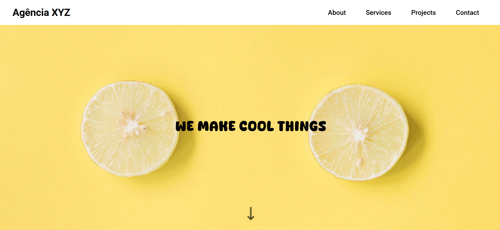
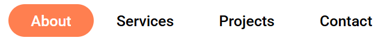
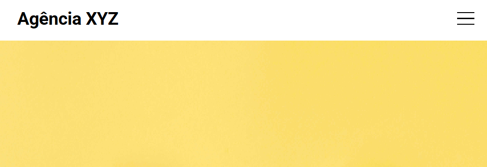
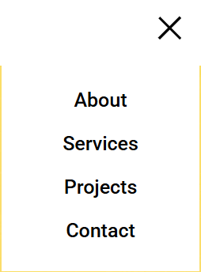
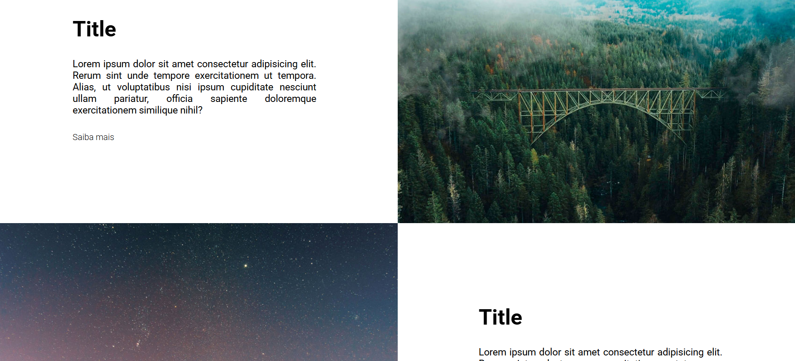
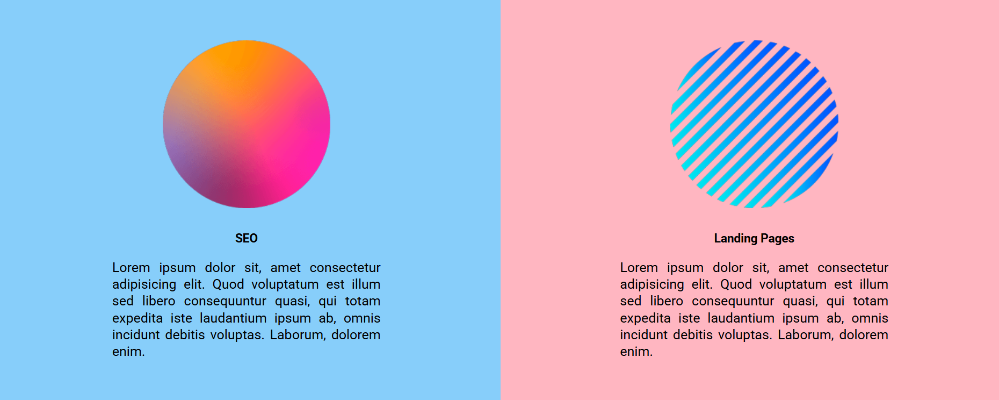
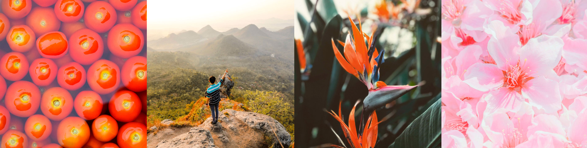
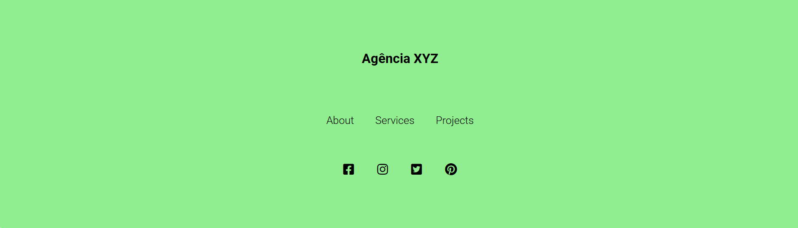
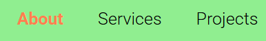

# Projeto Landing Page Agencia

## Sobre o projeto
Projeto desenvolvido no curso DevQuest utilizando os conceitos de grid, estilização organizada. 
O projeto é uma Landing Page para uma Agência Genérica com sessões de sobre, serviços, projetos e contato.

### Tela inicial da Landing Page

### Efeito de hover na logo e no cabeçalho

### Responsividade no menu

### Tela About

### Tela Services

### Tela Projects

### Efeito hover nos projetos

### Tela Contact

### Efeito hover rodapé

### Efeito hover nas redes sociais

## Conclusão final do projeto
Projeto bem desenvolvido utilizando os conceitos do grid. Estilização bem organizada utilizando variables, reset e estilização com fontawesome. 
Lnading Page responsiva e com menu modificado para o modelo "hambúrguer"

## Tecnologias utilizadas

 
    <ul>
        <li>HTML 5
        
        </li>
         
        <li>CSS 3
        
        </li>
         
    </ul>

